# How glyphsketch recognizes a drawing: the machine learning

This document explains the machine learning in glyphsketch for readers who know the basics
(training data, a loss function, a neural network learning from examples) but not
necessarily the tools and jargon. Technical terms are explained where they first appear, and
again in the [glossary](#glossary) at the end. The reasoning behind each choice is in
`docs/project/DECISIONS.md`; the decision numbers (D22 and so on) point there. All numbers
come from `EVAL.md` and `export/README.md` as of 2026-09-29.

## 1. The problem

You draw a character with a finger, mouse or pen. glyphsketch returns a ranked list of
Unicode characters it might be. The shipped version knows **28,711 characters**: Latin,
Greek, Cyrillic, Arabic, Hebrew, maths symbols, arrows, emoji, music symbols, Egyptian
hieroglyphs, about 190 historic and living scripts, and more.

The requirements shape everything below (`docs/project/BRIEF.md`):

- **It runs on the device, offline**, inside a phone keyboard and in a web page.
- **Small and fast.** Model and data together must fit in about 15 MB, and a query must
  take under about 300 ms on a mid-range phone.
- **Adding a character must never need new handwriting data.** This is the key constraint.
  For almost all of these 28,711 characters, nobody has ever collected handwritten samples.

## 2. The core idea: retrieval instead of classification

The usual way to recognize handwriting is a **classifier**: a network whose last layer has
one output per character, trained on many handwritten examples of each. That fails both
the third requirement (you can't train an output for a character you have no drawings of)
and the second (a fixed output per character grows with the character set, and every new
character means retraining).

glyphsketch uses **retrieval** instead, the way a search engine or a "find similar images"
feature works:

1. A neural network, the **encoder**, turns any 64×64 black-and-white image into a list of
   48 numbers, called an **embedding**. Think of it as a point in a 48-dimensional space.
   The encoder is trained so that images of the same character land close together, and
   images of different characters land far apart.
2. Before shipping, every character is **rendered from fonts** (drawn as an image the way a
   computer would display it as text) and each render is passed through the encoder. The
   resulting embeddings are stored in a file called the **index**: 115,248 vectors, one per
   (character, font) pair.
3. When you draw, your drawing goes through the *same* encoder. The characters whose index
   vectors are nearest to your drawing's embedding are the candidates.

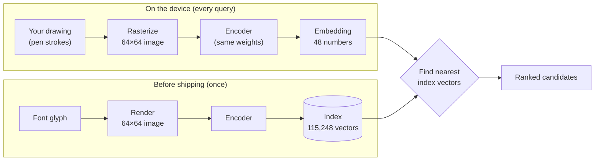

Adding a character is now just: render it from a font, run it through the encoder, append
the vector to the index. No handwriting, no retraining. About 18,000 characters, among
them the Egyptian hieroglyphs, were added exactly this way after the encoder was trained
(D37, D40).

"Nearest" is measured with **cosine similarity**: the cosine of the angle between two
vectors, 1 when they point the same way and lower as they diverge. The encoder scales its
outputs to length 1 (**L2 normalization**), so cosine similarity is simply the dot product
(multiply matching entries and add up), which is cheap.

A character that appears in several fonts has several index vectors, and it scores the
**best** of them. This turned out to matter: a drawn single-storey "a" matches a
handwriting font's "a" well even though it matches a serif font's double-storey "a" badly.
Averaging a character's vectors into one lost 2–5 points of accuracy (D29).

The difference between the two approaches, in short:

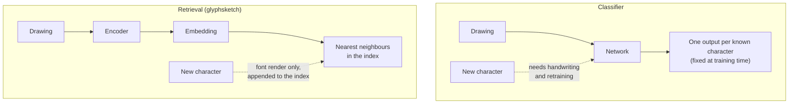

## 3. The encoder

### What a CNN is

The encoder is a **convolutional neural network (CNN)**, the standard network type for
images. A **convolution** slides a small filter (here 3×3 pixels) over the image and
computes a weighted sum at every position. Each filter learns to respond to some local
pattern, like an edge at a particular angle or a line ending. Stacking layers lets later
layers combine these into larger patterns: curves, loops, crossings, and eventually whole
shapes. Each layer produces several **channels**, one per filter: images of "how much of
pattern k is here".

A **stride** of 2 means the filter moves 2 pixels at a time, halving the image's width and
height. The encoder does this four times, going from 64×64 pixels down to 4×4 positions,
while the number of channels grows from 16 to 192. At the end, **global average pooling**
averages each channel over the remaining positions, giving one number per channel
regardless of where on the image a pattern was. A final **linear layer** (each output is a
weighted sum of all inputs) maps those numbers to the embedding.

Between layers sits an **activation function**, a simple nonlinear function without which
stacked layers would collapse into one linear operation. glyphsketch uses **ReLU6**:
`min(max(x, 0), 6)`, that is, negatives become 0 and values are capped at 6.

### Why this particular architecture

The layout follows **MobileNetV2**, a well-known design for phones. Its building block,
the **inverted residual block**, does three steps:

1. a **1×1 convolution** that widens the number of channels (it mixes channels at each
   pixel but looks at no neighbours);
2. a **depthwise 3×3 convolution**, which filters each channel separately instead of
   mixing all channels together. That costs roughly as many times less as there are
   channels;
3. another 1×1 convolution that narrows the channels again.

When the block's input and output have the same shape, the input is added to the output
(a **residual connection**), which makes deep networks easier to train.

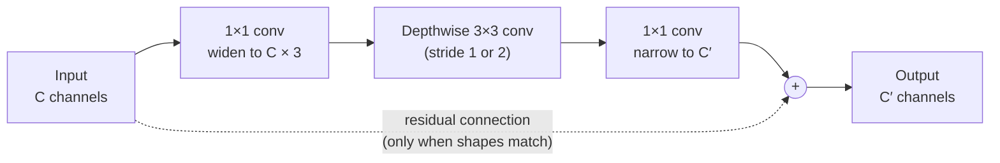

(The expansion factor is 3 in all blocks but the first, which uses 2. Each convolution is
followed by batch normalization and, except for the last one in the block, ReLU6.)

The whole encoder, with the image size and channel count after each stage:

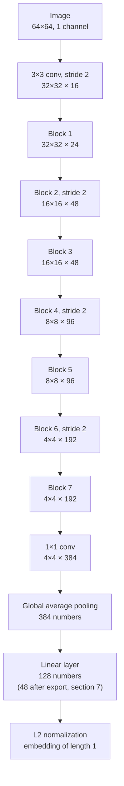

The result: **546,000 parameters** (the learned numbers, mostly filter weights) and **22.4
million multiply-adds** per image. That's tiny by current standards; it needs about 0.5 MB
on disk and runs in milliseconds.

It deliberately uses only seven kinds of operation. Section 7 explains why: the network is
re-implemented by hand in TypeScript and Kotlin, and every extra operation would be more
code to write and test.

**Batch normalization** layers sit after each convolution during training. They rescale
each channel to a stable range, which makes training faster and more reliable. Once
training is done they are just a fixed multiply and add, so the export **folds** them into
the preceding convolution's weights, and the shipped model has no separate batch norm step.

### One encoder for both sides

The same encoder, with the same weights, embeds both the drawings and the font glyphs.
This is why the drawing is turned into an image first (**rasterized**) rather than fed in
as a sequence of pen movements: a font glyph has no pen movements, so a stroke-based
model couldn't embed the glyph side of the index (PLAN.md, section 1). The cost is that
the model can't use stroke order.

## 4. Training data

The encoder must learn that a wobbly hand-drawn ∑ and a crisp font ∑ are "the same". It
needs pairs of (drawing, glyph) for training. Two sources supply them.

### Fonts

203 freely licensed font files (D9, D34, D40). Variety matters more than count: thirteen
handwriting-style fonts supply the letterforms people actually write (single-storey a and
g, Russian cursive, cursive Hebrew), math fonts cover the maths symbols, and the Noto
family covers most scripts. Each glyph is drawn so its longer side fills 7/8 of a square
image, centered (D11). Drawings get exactly the same framing. This throws away size and
position, because a drawing has no baseline or text size to compare against, so a period
and a bullet (`.` and `•`) look alike after framing; section 6 deals with that.

### Synthetic handwriting

**Synthetic data** is training data generated by a program instead of collected from
people. glyphsketch generates fake hand drawings from the font glyphs (D21; examples in
`docs/images/synthetic_gallery.png`):

1. **Skeletonize** each glyph: thin its ink down to one-pixel-wide center lines, then trace
   those lines into separate strokes, the way a person would draw them (a T becomes a bar
   and a stem). Large filled shapes like ■ or ★ use their outline instead, since people
   draw outlines; small dots become a single tap.
2. **Distort** the strokes the way real hands do: shift, rotate and resize each stroke a
   little; make ends overshoot or fall short; add wobble; round corners; open closed loops
   sometimes; bend the whole drawing with a smooth random warp; shear and stretch it; vary
   the pen width.
3. **Rasterize** with the same code that rasterizes real drawings.

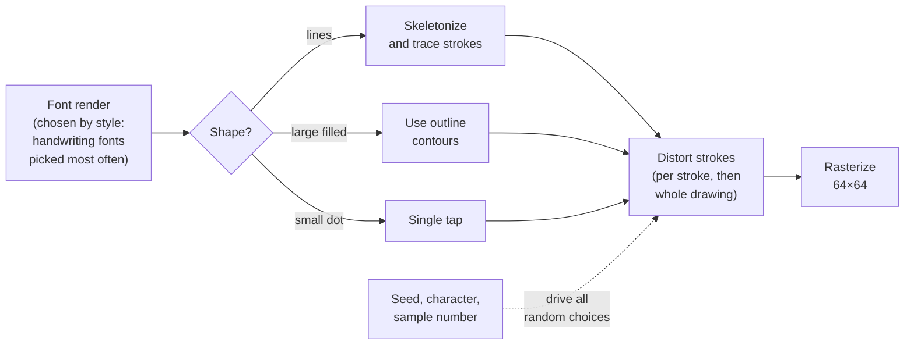

This is a form of **data augmentation**: creating varied training examples by applying
random but realistic transformations. Because it works on strokes rather than pixels, it
can move strokes independently, which pixel-level warping can't. Every sample is fully
determined by a **seed** (the starting value of the random number generator), so the
data can be regenerated exactly.

The pre-generated pool holds 96 synthetic drawings per character.

### Real handwriting

Three openly licensed datasets of real drawings, 223,038 samples of 998 characters (D13):

| Dataset | What it contains |
|---|---|
| Detexify | LaTeX maths symbols drawn in a web page; 93% of the samples |
| Omniglot | Letters of six alphabets (Greek, Cyrillic, Hebrew, …), drawn by paid online workers |
| UJI Pen Characters | Latin letters, digits and punctuation drawn on tablets |

Each dataset labels drawings in its own way (Detexify uses LaTeX commands like `\varphi`),
so every label was mapped to a Unicode code point and checked visually against the
drawings (D14, D15).

Real data covers only 998 of the 28,711 characters. It is mixed in: in each training
example, a drawing is a real one with probability 0.35 when real drawings of that
character exist, and synthetic otherwise.

### Keeping the test honest

Data used to measure the model must never be used to train it, or the measurement is
too optimistic. glyphsketch holds out two things (D16):

- **20% of the writers.** All drawings by a held-out person go to the test set, so the
  test measures how well the model handles *new people's* handwriting, not just new
  drawings by people it has seen.
- **25% of the characters with real data** are **zero-shot**: their real drawings are never
  used in training, only their synthetic ones. "Zero-shot" means recognizing a class with
  zero real training examples. These characters are the evidence that the main promise
  holds: they stand in for all the characters that have no handwriting data anywhere.

Both choices are made by hashing the writer or the code point, so the split doesn't
depend on file order and stays stable as data is added.

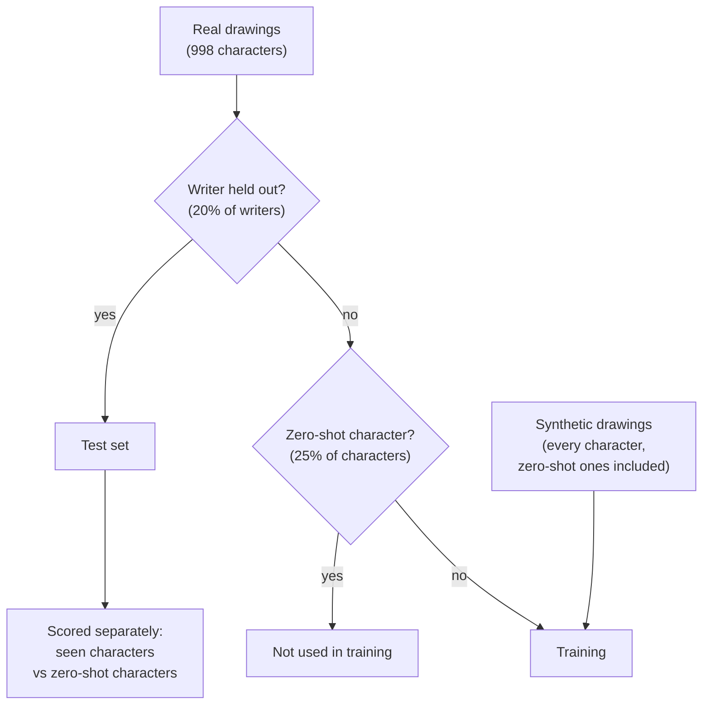

## 5. How the encoder is trained: contrastive learning

### The idea

**Contrastive learning** trains an embedding by comparison instead of by labels: "these
two things should be close, those should be far apart". Each training **batch** (the set
of examples processed together in one training step) holds 256 different characters, each
with three images: two drawings (synthetic or real; called **views**) and one font render.

For each drawing, the matching glyph is the **positive**, and the other 255 glyphs in the
batch are **negatives**. The model is rewarded when the drawing's embedding is more similar
to its positive than to every negative.

### The loss: InfoNCE

The **loss function** is the number training tries to make small. glyphsketch uses
**InfoNCE**, the standard contrastive loss (also used by OpenAI's CLIP image-text model):

1. Compute the similarity of drawing *i* with every glyph in the batch: 256 numbers.
2. Multiply them by a factor called the inverse **temperature**. A low temperature
   sharpens the differences; the model learns this factor itself.
3. Apply **softmax**, which turns the numbers into probabilities that add up to 1.
4. The loss is how little probability went to the correct glyph (**cross-entropy**:
   `−log(probability of the right answer)`).

In effect, each drawing must pick its own glyph out of a lineup of 256, and each step
updates the network so it does a bit better at that.

Three InfoNCE terms are added up: drawing → glyph, glyph → drawing, and drawing → the
other drawing of the same character. The last teaches drawings of the same character to
cluster, which helped one of the index variants tried (section 8).

One training step, from batch to weight update:

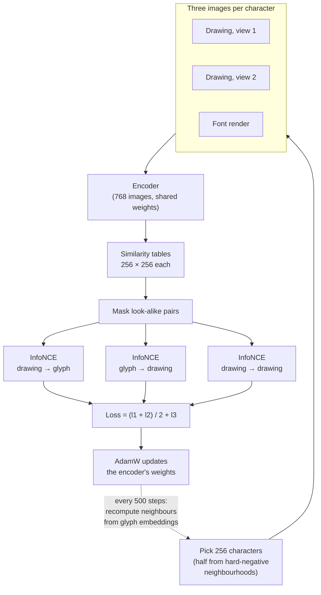

The table the softmax works on, for a batch of four characters where A and Α are
look-alikes (✓ = positive, ✗ = negative, – = masked):

| | glyph A | glyph Α | glyph ∫ | glyph ∑ |
|---|:-:|:-:|:-:|:-:|
| **drawing of A** | ✓ | – | ✗ | ✗ |
| **drawing of Α** | – | ✓ | ✗ | ✗ |
| **drawing of ∫** | ✗ | ✗ | ✓ | ✗ |
| **drawing of ∑** | ✗ | ✗ | ✗ | ✓ |

### Two refinements

**Look-alikes are not negatives.** Latin A, Greek Α and Cyrillic А are drawn identically
by every font. If they appeared in a batch as each other's negatives, the loss would push
apart pixel-identical images, which is impossible and would just confuse training. So
characters are grouped into **confusable groups** (look-alikes, see section 6), and pairs
in the same group are removed from the lineup (**masked**) before the softmax (D17, D22).

**Hard negatives.** Random negatives are mostly easy: telling ∫ from ☺ teaches little.
**Hard negatives** are wrong answers that look similar to the right one, like ∫ next to ʃ
or ſ. Half of each batch is built from neighbourhoods: one character plus up to 7 of its
nearest neighbours from other groups. The neighbours are first taken from a simple
handcrafted image comparison (HOG, see section 8), then recomputed every 500 steps from
the model's own embeddings, so the batch keeps up with what the model currently confuses.

### Optimization settings

The weights are updated with **AdamW**, a widely used variant of gradient descent that
adapts the step size per weight and includes **weight decay** (a slight pull of all
weights toward zero, which discourages overfitting). The **learning rate** (how big each
update is) starts with a **warm-up**: it rises linearly over the first 300 steps from near
zero, because large updates at the start, while the weights are random, can derail
training. After that it follows a **cosine decay**: it falls smoothly along a half cosine
curve to zero by the last step, so training ends with small, careful adjustments.

The schedule of the shipped run (peak 0.003, 30,000 steps; the 300-step warm-up is too
short to show at this scale):

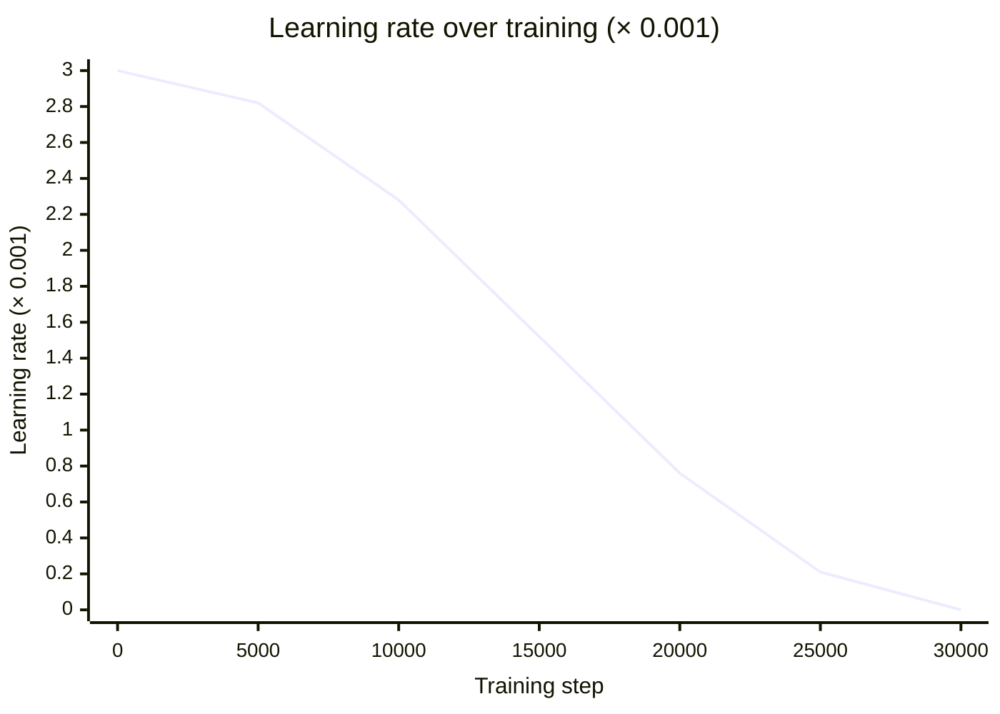

### Where it was trained

The code is written with **PyTorch**, a Python library for building and training neural
networks (others are TensorFlow and Keras). Training is far faster on a **GPU** (a graphics
card, which does many multiplications in parallel) than on a laptop processor. Short
comparison runs (1,701 steps) ran on the laptop; the shipped encoder ran 30,000 steps on
**Kaggle**, a website that offers free GPU time for notebooks, taking 2.9 hours on an
NVIDIA T4 GPU (D24, D34).

## 6. From similarities to a result list

### The frequency prior

The encoder alone ranks by shape. But when a drawing is equally similar to `e` and to an
obscure character, `e` is much more likely what you meant. A **prior** is knowledge of how
likely each answer is before looking at the evidence. glyphsketch counts how often every
character appears in Wikipedia articles in 18 languages, averaging over languages so that
Greek and Hebrew characters aren't drowned out by English (D25). The final score is:

```
score = similarity + 0.002 · log(frequency)
```

The weight 0.002 is a **hyperparameter**: a setting chosen by people (by trying values)
rather than learned by training. It was tuned on a **validation set**, a set of drawings
kept apart for tuning that is neither training data nor the final test set. Using the test
set for tuning would make the test results look better than they are. The prior adds about
4 points of top-1 accuracy (D26).

### Look-alike groups and result tiles

Some characters can't be told apart once drawn: A/Α/А, o/O/ο/О/0 after size framing, `.`
and `·`. glyphsketch builds 1,604 **confusable groups** (D17), the largest with 65
members. Candidate pairs come from Unicode's own list of confusable characters; two
characters stay in a group only if their rendered glyphs overlap closely in most fonts.
The grouping uses **complete-linkage clustering**, a clustering method in which every pair
of members of a group must be similar (not just a chain of neighbours: otherwise
6 → б → о → O would end up in one group).

The result list then shows **one tile per group**. The tile shows the member most likely
wanted, using the keyboard's language (a Greek keyboard shows Α, an English one A), and a
long-press offers the others. Merging look-alikes frees slots in the top five for genuinely
different candidates.

The whole query, from the drawing's embedding to the five tiles:

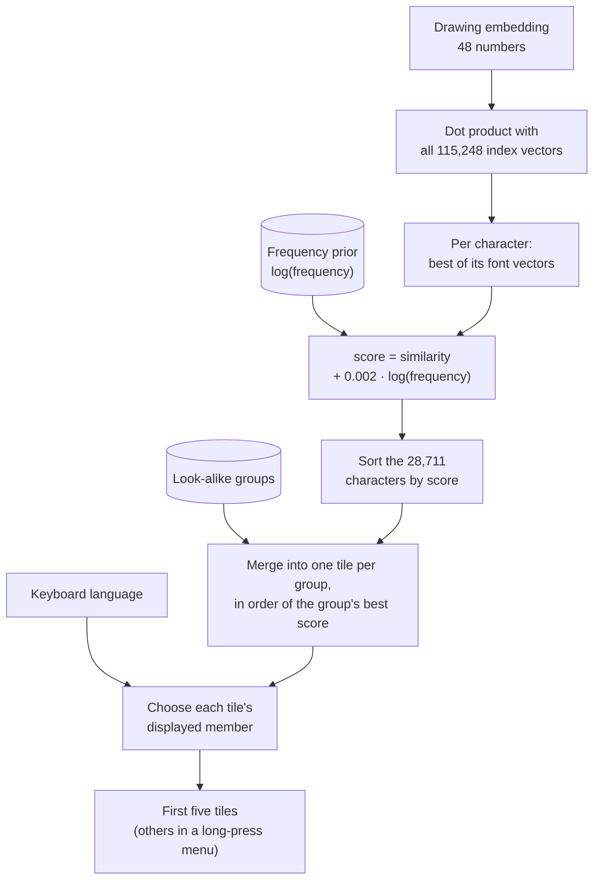

## 7. Making it small and portable: export

Training produces a model in PyTorch's format, running in Python. The phone and the web
page have neither, so the **export** stage converts it (D27).

**Quantization.** Each weight is normally a 32-bit floating point number. **int8
quantization** stores it as an 8-bit integer (−127…127) plus one scaling factor per
output channel ("per-channel"): real weight = integer × scale. That divides the size by
four. The engines turn the integers back into floats when loading (**dequantize**) and
compute in floats, so int8 here is for size only. The index vectors are stored the same
way, one scale per vector. Measured on the test set, int8 loses nothing.

**PCA.** The encoder outputs 128 numbers, but it uses few of those directions: 46 of them
hold 99% of the variation among the index vectors. **Principal component analysis (PCA)**
finds the directions in which the data varies most, so the vectors can be projected onto
the top 48 of them and the rest dropped. Since that projection is a linear operation, it is
folded into the encoder's last linear layer and costs nothing at query time. The index
shrank from 128 to 48 numbers per vector at no measurable cost in accuracy, while every
way of dropping vectors (averaging per character, clustering, removing near-duplicates)
did cost accuracy.

**Own file format and engines.** The model is written to a small custom binary format
(`docs/export_format.md`) and run by hand-written **inference engines** in TypeScript (web)
and Kotlin (Android). An inference engine is code that runs an already trained network on
new inputs; it never trains. The obvious alternative is **ONNX**, a standard file format
for neural networks, run by **ONNX Runtime**, a fast engine for it. ONNX Runtime was
benchmarked (D36): it encodes 25 times faster on an Android emulator, but its Android
library alone is 33 MB, twice the whole budget, and it is prebuilt native code, which the
F-Droid app store, which builds every app from source, makes difficult. The hand-written
Kotlin engine is about 150 kB and still takes about 55 ms for a whole query on the
emulator, well within the 300 ms budget.

**Parity tests** guard against the engines drifting from the Python original. The export
writes `export/fixtures.json`: 25 drawings with the exact expected input image, embedding,
ranking and tiles. The TypeScript and Kotlin tests check every one (images byte for byte,
numbers within 1e-4).

The shipped files are 9.30 MB: the model is 0.54 MB, the index 6.2 MB, and the character
metadata (names, look-alike groups, prior) 2.5 MB.

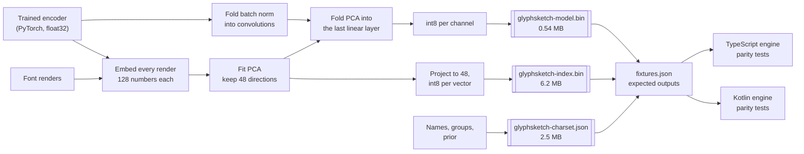

## 8. How well it works

### Metrics

- **Top-1 accuracy**: how often the first candidate is the drawn character. **Top-5**: how
  often it is among the first five, which is what matters for a keyboard showing five
  tiles.
- **Confusable-aware** ("conf."): a prediction in the right look-alike group counts as
  correct, since Latin A for a drawn Greek Α is the right shape.
- **Per sample** versus **per character**: the first averages over all test drawings, the
  second over characters, so that ∫ and α, with thousands of drawings each, don't dominate
  (a **macro** average).

### Baselines

A **baseline** is a simple method that sets the bar a learned model must clear. glyphsketch
has two that need no training (D20): compare the drawing directly with every glyph render
by raw pixels, or by **HOG** (histogram of oriented gradients, a classic handcrafted image
descriptor that counts edge directions in small cells of the image). The better one, HOG,
reaches 45.0% top-5 (conf.).

### Results of the shipped package

On drawings by held-out writers (`EVAL.md`):

| Measure | Result |
|---|---:|
| Right look-alike group among the first five tiles | 83.7% |
| First tile is exactly the drawn character | 52.5% |
| Ranked characters, top-1 / top-5 | 49.6% / 78.5% |
| Zero-shot characters, tile top-5 (conf.) | 77.9% |
| Characters with real training drawings, tile top-5 (conf.) | 85.8% |
| HOG baseline, top-5 (conf.) | 45.0% |

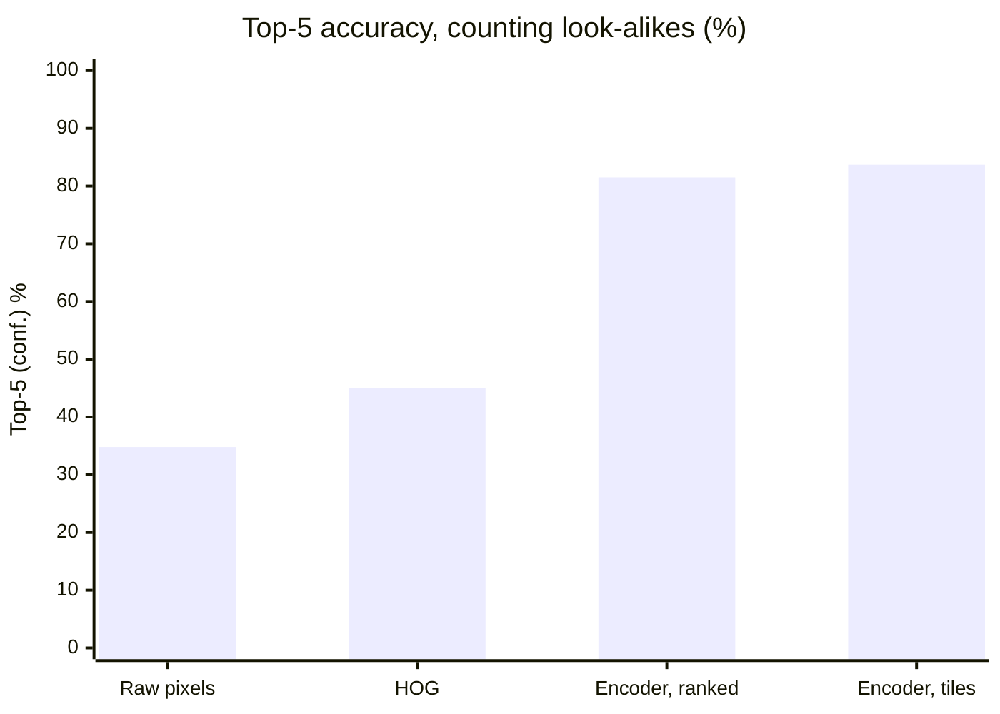

The model picks among 28,711 characters, where chance would be 0.003%. The gap between
zero-shot and seen characters (about 8 points) is the price of having no real drawings,
and it is moderate, which supports the main design choice.

### What the experiments showed

An **ablation** is an experiment that removes or changes one ingredient to see how much it
matters. The main ones (D22, D29, D27):

- **Real drawings help, even for zero-shot characters.** Training on synthetic plus real
  drawings beat synthetic only, also on the characters whose real drawings were held out
  (zero-shot top-5 conf. 78.4% vs 74.9%). Real handwriting teaches how people draw in
  general (proportions, sloppy joins), not just the characters in the data.
- **Synthetic-only training plateaus.** 17 times as many steps gained 1 point. The
  difference between synthetic and real drawings limits it, not training time.
- **One index vector per font beats averages.** Keeping each font's vector beat both the
  mean of the font renders and the mean of 16 synthetic drawings per character (the
  "option (b)" index): averaging blurs away the styles people actually draw in.
- **PCA to 48 dimensions and int8 cost nothing.**

### Comparison with a classifier

Detypify is an open-source recognizer for 411 maths symbols, built the classic way: a
classifier trained on Detexify's real drawings. On those 411 symbols it is clearly better
(87.8% vs 74.8% top-1 when glyphsketch is restricted to the same 411 candidates), which is
expected: a classifier trained on real data of a fixed set is the right tool for that set,
and its training data may even include our test writers (D31). glyphsketch trades that
accuracy for 70 times the coverage and for adding characters from a font alone.

### Known weaknesses

- **Filled vs outlined and small vs large** (■ □, ● ○, ▪ ■) look the same as pen
  drawings after size framing. Geometric Shapes is the weakest block.
- **Styled alphabets** (𝒜, 𝔄, ℬ): people draw a plain letter, while the font glyph is
  ornate.
- **The test set is 93% maths symbols** drawn on a web page. Finger drawings on a phone
  may behave differently, and most of the characters added later (emoji, music, scripts)
  are measured only on synthetic drawings, which flatter the model.

## Glossary

| Term | Meaning |
|---|---|
| Ablation | An experiment that removes or changes one part of a system to measure its contribution. |
| Activation function | A simple nonlinear function between network layers; here ReLU6. |
| AdamW | A popular optimizer: gradient descent with per-weight adaptive step sizes and weight decay. |
| Augmentation | Creating varied training examples by applying random, realistic transformations. |
| Baseline | A simple reference method a new model must beat. |
| Batch | The examples processed together in one training step; here 256 characters × 3 images. |
| Batch normalization | A layer that rescales each channel to a stable range during training; folded into the convolutions at export. |
| Channel | One of the parallel feature maps a convolution layer outputs, one per filter. |
| Classifier | A model with one output per class, trained to pick the class; contrasted here with retrieval. |
| CNN | Convolutional neural network: a network built mainly from convolutions; the standard choice for images. |
| Complete-linkage clustering | Grouping in which every pair of members must be within the similarity threshold. |
| Confusable group | Characters that look the same when drawn (A, Α, А); treated as one answer for scoring and shown as one tile. |
| Contrastive learning | Training an embedding by pulling matching pairs together and pushing non-matching ones apart. |
| Convolution | Sliding a small learned filter over an image, computing a weighted sum at each position. |
| Cosine similarity | Similarity of two vectors by the angle between them; for unit-length vectors, their dot product. |
| Cosine decay | A learning-rate schedule that falls smoothly to zero along a half cosine curve. |
| Cross-entropy | The loss `−log(probability given to the correct answer)`. |
| Depthwise convolution | A convolution that filters each channel separately; much cheaper than a standard one. |
| Embedding | A fixed-length list of numbers representing an input, placed so similar inputs are close together. |
| Encoder | The network that maps an image to its embedding. |
| Epoch | One pass over the whole training set (glyphsketch counts steps instead, since its data is resampled). |
| Export | Converting the trained model into the compact files the apps ship. |
| Folding | Merging a fixed linear operation (batch norm, PCA) into a neighbouring layer's weights so it costs nothing at run time. |
| GPU | Graphics processor; trains neural networks much faster than a regular processor. |
| Hard negative | A wrong answer that looks similar to the right one; more informative for training than a random one. |
| HOG | Histogram of oriented gradients: a handcrafted image descriptor based on edge directions. |
| Hyperparameter | A setting chosen by people rather than learned, such as the learning rate or the prior weight. |
| Index | The stored embeddings of all font glyphs that a drawing is compared against. |
| Inference | Running a trained model on new input (as opposed to training it). |
| InfoNCE | A contrastive loss: softmax over the similarities to one positive and many negatives, then cross-entropy. |
| int8 quantization | Storing numbers as 8-bit integers plus a scale factor, to save space. |
| Inverted residual block | MobileNetV2's building block: 1×1 widen, depthwise 3×3, 1×1 narrow, with a shortcut. |
| Kaggle | A data science website that provides free GPU time for notebooks; used for the long training runs. |
| Keras, TensorFlow | Other widely used libraries for building and training neural networks; not used here. |
| L2 normalization | Scaling a vector to length 1. |
| Learning rate | How large each training update is. |
| Linear layer | A layer where each output is a weighted sum of all inputs plus a constant. |
| Loss function | The number training minimizes; it measures how wrong the model is on a batch. |
| Macro average | An average over classes (characters) rather than over samples. |
| Masking | Removing certain entries (here, look-alike pairs) from a computation. |
| MobileNetV2 | A CNN design for phones that gets high accuracy per computation. |
| Multiply-add | One multiplication plus one addition; the usual unit of a network's compute cost. |
| Negative / positive | In contrastive learning, the wrong and right partners for an example. |
| ONNX / ONNX Runtime | A standard file format for neural networks, and a fast engine that runs it; used here only as a reference and benchmark. |
| Overfitting | Learning the training data's quirks instead of general patterns, so new data does worse. |
| Parameters | The learned numbers of a network (mostly filter weights); 546,000 here. |
| Parity test | A test that the hand-written engines give the same results as the Python original. |
| PCA | Principal component analysis: finds the directions of greatest variation, used to shorten vectors. |
| Pooling (global average) | Averaging each channel over all positions, giving one number per channel. |
| Prior | How likely each answer is before seeing the input; here character frequency in Wikipedia. |
| PyTorch | A Python library for building and training neural networks; used for training here. |
| Rasterize | Turn a vector drawing (strokes or a font outline) into a pixel image. |
| ReLU6 | The activation `min(max(x, 0), 6)`. |
| Residual connection | Adding a block's input to its output; makes deep networks easier to train. |
| Retrieval | Finding the stored items nearest to a query, instead of predicting a class directly. |
| Seed | The starting value of a random number generator; the same seed gives the same "random" data. |
| Skeletonization | Thinning a shape to one-pixel-wide center lines. |
| Softmax | Turns a list of scores into probabilities that add up to 1. |
| Stride | How many pixels a filter moves at each step; stride 2 halves the image size. |
| Synthetic data | Training data generated by a program rather than collected from people. |
| Temperature | A factor that sharpens or flattens the softmax; learned during training here. |
| Test set | Data kept entirely apart to measure the finished model. |
| Top-k accuracy | How often the right answer is among the first k candidates. |
| Validation set | Data kept apart from training for tuning settings, separate from the test set. |
| View | One of several differently distorted versions of the same example. |
| Warm-up | Starting training with a small learning rate that ramps up over the first steps. |
| Weight decay | A slight pull of all weights toward zero during training, to discourage overfitting. |
| Zero-shot | Recognizing a class with no real training examples of it. |
